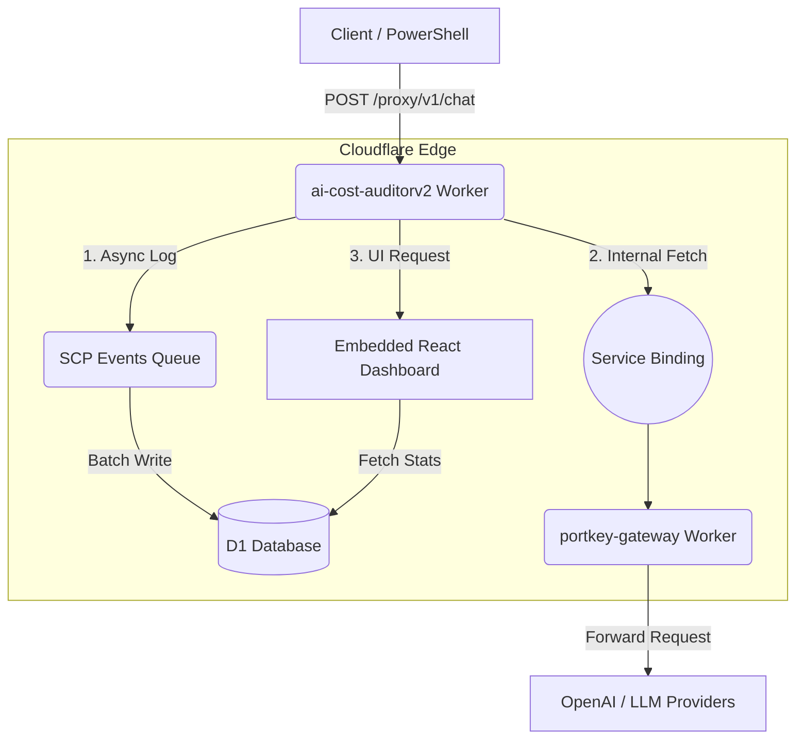

# AI Cost Auditor: Implementation & Architecture Guide

This document outlines the end-to-end architecture, deployment strategy, and technical decisions behind the AI Cost Auditor platform deployed on Cloudflare.

## 🏗 System Architecture

The platform acts as an intelligent, cost-saving proxy that sits between your applications and your AI providers (OpenAI, Anthropic, etc.).



## 🧩 Core Components

### 1. The Policy Engine (`ai-cost-auditorv2`)
The central "Brain" of the application. 
- **Repository:** `AICA0912`
- **Role:** Intercepts all traffic, evaluates 16 custom financial rules, checks the $1,000 budget ledger, and dynamically overrides expensive models (e.g., swapping `gpt-4o` to `gpt-3.5-turbo` for short prompts) to save money.
- **Dashboard:** Serves a serverless React/Tailwind frontend on the `/dashboard` route.

### 2. The Private Gateway (`ai-cost-auditor-portkey`)
A fully self-hosted deployment of the Portkey open-source gateway.
- **Repository:** `portkey-gateway-repo` (Internal)
- **Role:** Translates the standardized request format into the specific API specs for over 200+ AI providers.
- **Crucial Implementation Detail:** It is connected to the Policy Engine via a **Cloudflare Service Binding**. This prevents Cloudflare Loopback Errors (Error 1042) and ensures the traffic travels instantly over Cloudflare's private backbone instead of the public internet.

### 3. The Telemetry Layer (D1 & Queues)
- **Database:** `ai-cost-auditor-db` (Cloudflare D1 SQLite)
- **Queues:** `scp-events` (Cloudflare Queues)
- **Role:** The Policy Engine fires telemetry data to the Queue in a "fire-and-forget" manner. The Queue then batches and writes these logs to the D1 database asynchronously. This guarantees **zero added latency** to the actual AI response returning to the user.

## 🚀 Deployment Pipeline

Both workers are deployed automatically via GitHub Actions:
1. **Push to `main`**: Triggers the `.github/workflows/deploy.yml` pipeline.
2. **Cloudflare Authentication**: The action uses a hardcoded `accountId` override to bypass Cloudflare API permission checks.
3. **Wrangler Rollout**: Deploys the code seamlessly to the `*.workers.dev` edge.

## 💻 Usage

To route traffic through the system, point your standard AI API calls to your worker URL and pass the `X-API-Key` and `x-portkey-provider` headers.

**Example PowerShell Request:**
```powershell
$headers = @{
    "X-API-Key" = "container-internal"
    "x-portkey-provider" = "openai"
    "Authorization" = "Bearer sk-YOUR-OPENAI-KEY"
    "Content-Type" = "application/json"
}

$body = @{
    model = "gpt-4o"
    messages = @(
        @{ role = "user"; content = "Hello, how are you?" }
    )
} | ConvertTo-Json

Invoke-RestMethod -Uri "https://ai-cost-auditorv2.dl-56e.workers.dev/proxy/v1/chat/completions" -Method POST -Headers $headers -Body $body
```
